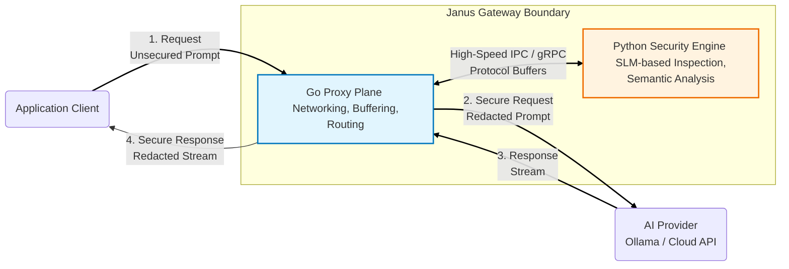

# Janus: High-Performance AI Security Gateway

Janus is an ultra-low latency reverse proxy designed to secure Large Language Model (LLM) workflows. It acts as a specialized security perimeter positioned between client applications and AI inference providers (such as Ollama, OpenAI, or Anthropic).

Janus provides real-time Prompt Injection Defense and streaming Personally Identifiable Information (PII) redaction while optimizing for minimal throughput overhead.

## Architectural Diagram

The following diagram illustrates the hybrid architecture of Janus, distinguishing between the high-concurrency data path and the semantic analysis engine.

