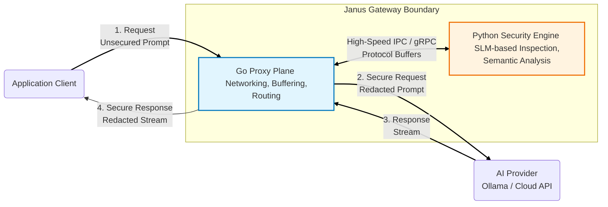

# Janus: High-Performance AI Security Gateway

Janus is an ultra-low latency reverse proxy designed to secure Large Language Model (LLM) workflows. It acts as a specialized security perimeter positioned between client applications and AI inference providers (such as Ollama, OpenAI, or Anthropic).

Janus provides real-time Prompt Injection Defense and streaming Personally Identifiable Information (PII) redaction while optimizing for minimal throughput overhead.

## Architectural Diagram

The following diagram illustrates the hybrid architecture of Janus, distinguishing between the high-concurrency data path and the semantic analysis engine.



---

## 1. Proxy Plane (Go)

The Proxy Plane is the **high-performance edge layer** responsible for handling all inbound and outbound traffic.

### Core Responsibilities

- TCP connection management
- SSL termination
- HTTP parsing and routing
- Request/response buffering
- Client-side streaming

### Design Rationale

Go is selected due to its:

- Lightweight concurrency model (goroutines)
- Efficient networking stack (`net/http`)
- Predictable memory management

### Performance Strategy

- **Zero-copy data pathing** is used wherever possible to minimize overhead.
- **Deterministic PII redaction** (e.g., regex for emails, API keys) is handled inline to avoid cross-process calls.
- **Streaming-aware processing** ensures responses are redacted in real-time without buffering entire payloads.

### Streaming Control

As responses stream back from the AI provider:

1. Data is processed in chunks.
2. Redaction rules are applied per chunk.
3. Cleaned data is forwarded immediately.

This maintains a **near-constant latency floor**, critical for real-time applications.

---

## 2. Intelligence Plane (Python)

The Intelligence Plane is responsible for **semantic security enforcement** using machine learning.

### Core Responsibilities

- Detecting adversarial prompt injections (jailbreak attempts)
- Identifying sensitive entities requiring context (e.g., PERSON, ORG)
- Performing context-aware redaction

### Design Rationale

Python is used to leverage:

- Mature ML/NLP ecosystem
- Rapid experimentation and model iteration
- Integration with lightweight models

### Performance Strategy

- Runs as a **separate process/container** to avoid Go bottlenecks
- Avoids Python’s GIL impacting networking throughput
- Uses **Small Language Models (SLMs)** instead of full LLMs


This ensures the intelligence layer does not become a system bottleneck.

---

## 3. Inspection Loop (Inter-Process Communication)

The Inspection Loop is the **synchronization mechanism** between the two planes.

### Workflow

1. A request arrives at the Proxy Plane.
2. If semantic inspection is required:
   - The request is paused.
   - Payload is serialized.
3. Data is sent to the Intelligence Plane via IPC.
4. The Python engine returns:
   - Safety score
   - Redacted content
5. The Proxy Plane updates the request.
6. Forwarding resumes to the AI provider.

### Communication Stack

- Protocol: **gRPC** or optimized **HTTP/2**
- Transport: **Unix sockets / localhost**
- Serialization: **Protocol Buffers (protobuf)**

### Why Protobuf?

- Lower latency vs JSON
- Reduced payload size
- Faster parsing on both ends

---

## Key Features

### Zero-Trust Prompt Inspection

- Every prompt is treated as potentially malicious
- Detects:
  - Prompt injections
  - Jailbreak attempts
  - Indirect adversarial inputs

---

### Streaming PII Redaction

- Real-time masking of:
  - Emails
  - Credit card numbers
  - Phone numbers
  - Named entities (e.g., PERSON)

- Works on:
  - Incoming prompts
  - Outgoing AI responses

---

- Achieved via:
  - Inline processing (Go)
  - Lightweight models (Python)
  - Efficient IPC

---

### Provider Agnostic

Janus acts as a **drop-in reverse proxy** for any OpenAI-compatible API:

- Cloud providers
- Self-hosted models
- Local runtimes (e.g., Ollama)

---

## Getting Started

### Prerequisites

- Go 1.21+
- Python 3.10+
- Access to an AI provider (API key or local deployment)

---

### Installation

```bash
# Clone the repository
git clone https://github.com/yourusername/janus.git
cd janus

# Build the Go Proxy
go mod download
go build -o janus-proxy cmd/main.go

# Setup the Python Intelligence Engine
pip install -r requirements.txt
```
```Yaml
server:
  port: 8080
  target_url: "http://localhost:11434"

security:
  redaction_level: "strict"   # options: lax, balanced, strict
  injection_shield: true
  pii_categories:
    - EMAIL
    - CREDIT_CARD
    - PHONE_NUMBER
    - PERSON
```
